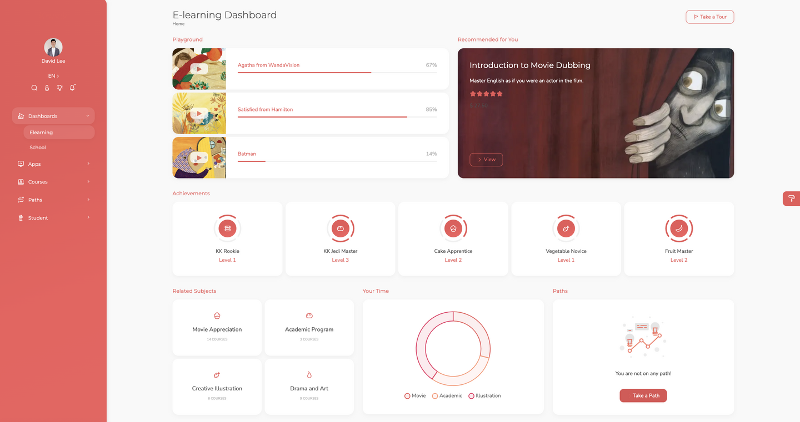

# Knock knock Admin Dashboard

- Look at the project here: https://kk-edu.netlify.app/register

## A 2023 modern React-Redux E-Learning Dashboard with a medium-large code base ready for desktop, tablet and mobile use.

- Built a complicated and well-structured web app with CRUD, search, filter, pagination, authentication and sort functions, and implemented features (including chat, todo, calendar, mailbox, tour, language switch, notification, video upload customization) by HTML, Sass, JavaScript, React and Redux.
- Optimized performance by a 36% reduction of memory usage by caching calculations between re-renders.
- Eliminated the boilerplate from hand-written Redux logic, provided APIs that simplify standard Redux tasks by switching out dev-mode middleware to catch accidental mutation and serializability errors in code bases.
Please take a tour and enjoy some interesting moments in my own startup.

## how to navigate:
- Press 'Take a Tour' button in the landing page of the dashboard - elearning page to how the basics
- The most complicated part of the project lies in the Apps of the sidebar.
All the students' names and profiles displayed in the app are real